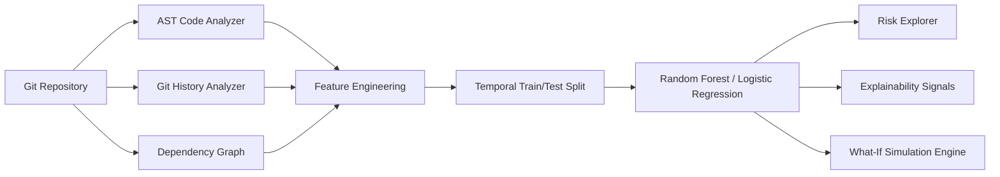

# SoftwarePulse: Evolution-Aware Software Risk Prediction and What-If Change Analysis

[](https://www.python.org/downloads/)
[](https://streamlit.io/)
[](https://scikit-learn.org/)
[]()

> **SoftwarePulse** is an evolution-aware software intelligence platform that analyzes a repository's source code characteristics, historical git churn, and dependency graph structure to estimate component-level risk, explain predictive signals, track software evolution, and simulate how hypothetical modifications alter predicted risk.

---

## 📌 Primary Research Question

> **"Does incorporating software evolution and dependency information improve component-level risk prediction compared with using static source-code characteristics alone?"**

SoftwarePulse demonstrates the quantitative transition from **static code analysis** to **evolution-aware predictive analytics**, comparing:
1. **Model A (Static Only)**: Lines of Code, Cyclomatic Complexity, Functions, Classes, Imports, Methods
2. **Model B (Static + Evolution)**: Model A + Commit Count, Churn, Recent Churn, Author Counts, Change Frequency
3. **Model C (Full)**: Model B + Out-Degree Dependencies, In-Degree Dependents, Total Degree, Degree Centrality

---

## 🚀 Key Capabilities

- **Repository Ingestion & Git Mining**: Ingests local Git repositories or clones remote GitHub repositories, extracting commit records, churn statistics, and heuristic bug-fix labels.
- **AST Code Analysis**: Parses Python AST to calculate McCabe cyclomatic complexity, LOC, functions, classes, and imports.
- **Dependency Graph Analysis**: Resolves intra-repository module imports and calculates in/out-degree and centrality using NetworkX.
- **Leakage-Free Temporal Splitting**: Prevents future data leakage by training strictly on historical commit snapshots and evaluating on subsequent periods.
- **Machine Learning Classifiers**: Trains Random Forest and Logistic Regression models with calibrated risk probabilities (`LOW`, `MEDIUM`, `HIGH`).
- **Explainable AI Signals**: Provides global model feature importances and localized component risk attribution breakdowns.
- **Interactive What-If Simulation Lab**: Simulates counterfactual modifications (adding/removing dependencies, adjusting complexity, modifying churn) and re-evaluates risk predictions in real-time.
- **Professional Developer UI**: Dark theme dashboard inspired by modern developer tools (GitHub, Linear, Vercel) built with Streamlit and Plotly.

---

## 🛠️ Architecture



---

## ⚡ Quickstart & Installation

### 1. Clone or Navigate to the Project
```bash
cd SoftPluse
```

### 2. Install Dependencies
```bash
pip install -r requirements.txt
```

### 3. Run the Application
```bash
streamlit run app.py
```

The application will launch in your browser at `http://localhost:8501`.

### 4. Run Unit Tests
```bash
pytest -v
```

---

## 📂 Project Structure

```
SoftPluse/
├── app.py                      # Main Streamlit application entrypoint
├── config.py                   # Centralized configuration & parameters
├── requirements.txt            # Python dependencies
├── PROJECT_STATUS.md           # Mid-semester progress tracker
├── README.md                   # Project documentation
│
├── ingestion/                  # Git & repository loading
│   ├── repository_loader.py    # Local & remote GitHub cloning
│   ├── git_loader.py           # Commit extraction & churn mining
│   └── repository_metadata.py  # Repository summary dataclasses
│
├── analysis/                   # Code, Git, and Dependency parsing
│   ├── code_analyzer.py        # Python AST metrics & complexity
│   ├── git_analyzer.py         # File-level evolution metrics
│   ├── dependency_analyzer.py  # NetworkX dependency graph
│   └── historical_analyzer.py  # Chronological snapshot builder
│
├── features/                   # Feature extraction & schema
│   ├── feature_schema.py       # Static, Evolution, and Structural schemas
│   └── feature_engineering.py  # Matrix consolidation & validation
│
├── dataset/                    # Temporal dataset construction
│   ├── labeling.py             # Bugfix association & proxy labeling
│   ├── temporal_split.py       # Chronological train-test splitting
│   └── builder.py              # End-to-end dataset builder
│
├── ml/                         # Machine learning models & evaluation
│   ├── train.py                # Random Forest & Logistic Regression
│   ├── predict.py              # Calibrated probability & categories
│   ├── evaluate.py             # Comparative research evaluation
│   └── model_manager.py        # Model serialization & persistence
│
├── explainability/             # Explainable AI
│   └── explainer.py            # Global importance & local attribution
│
├── simulation/                 # Counterfactual change engine
│   └── what_if.py              # What-If structural & complexity simulation
│
├── visualization/              # Plotly chart generators
│   ├── risk_charts.py          # Distribution & top risky charts
│   ├── evolution_charts.py     # Historical metric trajectories
│   ├── dependency_graph.py     # Interactive network diagram
│   └── component_view.py       # Radar & feature comparison plots
│
├── ui/                         # Streamlit design system
│   ├── styles.py               # Dark theme CSS & typography
│   ├── sidebar.py              # Navigation & repo selector
│   ├── header.py               # Top status bar
│   ├── components.py           # Metric blocks & badges
│   └── pages.py                # Dashboard page implementations
│
├── data/                       # Storage & sample repositories
│   ├── demo/                   # Built-in multi-commit microservices repo
│   ├── raw/                    # Cached cloned repositories
│   └── processed/              # Datasets
│
├── models/                     # Saved trained models (.pkl)
├── tests/                      # Automated test suite (Pytest)
└── docs/                       # Technical & methodology documentation
    ├── architecture.md
    ├── methodology.md
    └── research_notes.md
```

---

## 🔬 Mid-Semester Presentation Workflow

1. **Launch App**: `streamlit run app.py`
2. **Overview**: View repository summary metrics and risk distribution.
3. **Risk Explorer**: Drill into prioritized components (e.g. `services/payment_service.py` with high complexity and recent churn).
4. **Explainability**: Identify contributing model signals (recent churn, complexity, dependency count).
5. **Evolution**: Track complexity and churn trajectory across commit snapshots.
6. **Dependencies**: Explore component neighborhood coupling.
7. **What-If Lab**: Simulate hypothetical modification (e.g. adding dependency or modifying complexity) and observe real-time predicted risk shift.
8. **Model Evaluation**: Review experimental comparison confirming that evolution + dependency features improve F1-Score over static code metrics alone.

---

## 📄 Scientific Disclaimers

- **Risk Prediction**: Estimates statistical probability of future change volatility and defect association; does not prove the existence of bugs.
- **What-If Simulation**: Counterfactual sensitivity analysis modifying model feature representations; does not claim proven causal inference.
"# Softpluse" 
