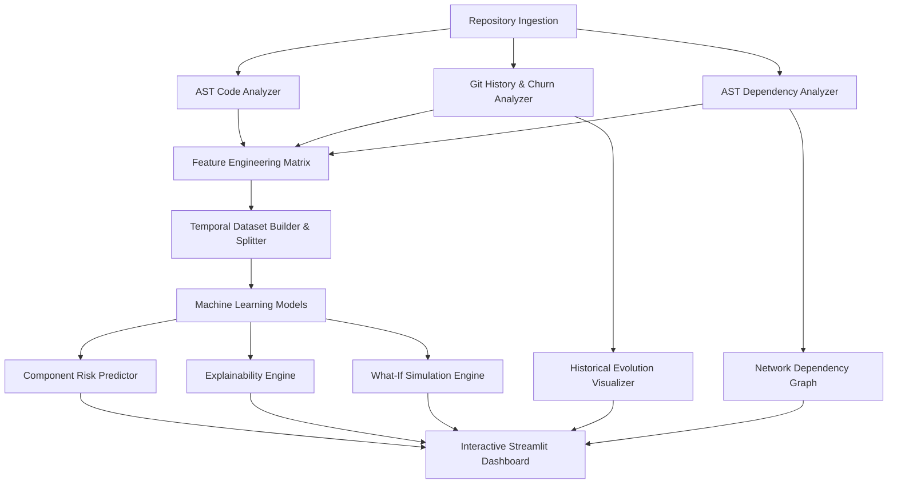

# SoftwarePulse Architecture

## 1. System Overview

SoftwarePulse is an evolution-aware AI platform for software risk prediction and counterfactual change simulation. It integrates static code characteristics, historical repository behavior, and graph dependency topology into a unified predictive pipeline.

## 2. Core Subsystems

### 2.1 Ingestion Subsystem (`ingestion/`)
- `RepositoryLoader`: Validates local folders or clones remote GitHub repositories safely.
- `GitLoader`: Extracts commit records, timestamps, commit messages, insertions, deletions, author data, and bugfix heuristics.
- `RepositoryMetadata`: Tracks repository statistics (contributors, languages, branches, dates).

### 2.2 Analysis Subsystem (`analysis/`)
- `CodeAnalyzer`: Extracts Python AST-based cyclomatic complexity, lines of code, functions, classes, imports, and methods.
- `GitAnalyzer`: Computes file-level evolution metrics, recent churn, historical churn, commit frequency, and author distribution.
- `DependencyAnalyzer`: Parses module imports, resolves intra-repository dependencies, and constructs directed graphs via NetworkX.
- `HistoricalAnalyzer`: Reconstructs chronological repository snapshots along the commit history.

### 2.3 Feature Subsystem (`features/`)
- `feature_schema.py`: Formulates three distinct feature groups:
  1. **Static Features**: LOC, Complexity, Functions, Classes, Imports, Methods
  2. **Evolution Features**: Commit Count, Churn, Recent Churn, Authors, Change Frequency, Time Since Last Change
  3. **Structural Features**: Dependency Count, Dependent Count, Total Degree, Centrality, In-Degree, Out-Degree
- `feature_engineering.py`: Consolidates multi-modal data into standardized matrices.

### 2.4 Dataset Subsystem (`dataset/`)
- `labeling.py`: Heuristic future bugfix association labeling and high-churn proxy labeling.
- `temporal_split.py`: Strict chronological train-test split preventing future data leakage.
- `builder.py`: Orchestrates feature extraction before split point and evaluation after split point.

### 2.5 Machine Learning Subsystem (`ml/`)
- `train.py`: Trains Random Forest and Logistic Regression classifiers.
- `predict.py`: Infers calibrated risk probabilities and assigns LOW, MEDIUM, and HIGH categories.
- `evaluate.py`: Runs comparative research evaluation across Model A (Static), Model B (Static+Evolution), and Model C (Full).
- `model_manager.py`: Model serialization and persistence.

### 2.6 Simulation Subsystem (`simulation/`)
- `what_if.py`: Counterfactual simulation engine for dependency additions/removals, complexity shifts, and churn adjustments. Recalculates graph structure and evaluates new risk predictions.
